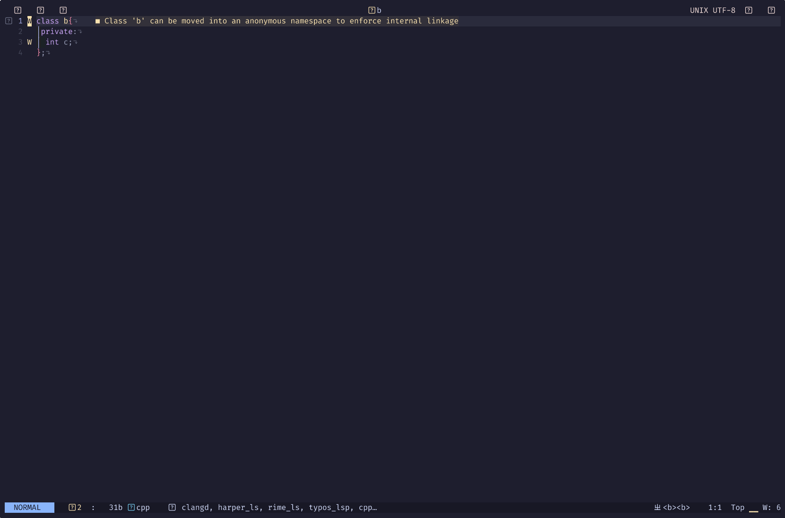

# List of C++ Tools

<!--toc:start-->
- [List of C++ Tools](#list-of-c-tools)
  - [Install](#install)
  - [USAGE](#usage)
<!--toc:end-->

## Install

for `lazy.nvim`

```lua
  {
    "cxwx/cxcpptools",
    opts = {},
    keys = {
      { ",og", function() 
        require('cxcpptools').generate_getter_setter() end,
        desc = "gen getter setter" },
    }
  },
```

## USAGE

- [X] getter setter for class members

  ```lua
  require('cxcpptools').generate_getter_setter
  ```
  
  
